[:arrow_backward:](Building-qXL.md) | [:arrow_forward:](Worksheet-VBA-API-Functions.md)

# Installation

- [System requirements](Installation.md#system-requirements)
- [Installing qXL](Installation.md#installing-qxl)
- [Uninstalling qXL](Installation.md#uninstalling-qxl)
- [Upgrading to newer version](Installation.md#upgrading-to-newer-version)

<!--------------------------------------------------------------------------------------------------------------------->

## System requirements

The following software is required to install `qXL`
- Operating system: Microsoft® Windows NT™ or later (both 32 and 64 bit versions)
- Microsoft® Excel 2003 or later
- Microsoft® .NET Framework version 4.0 or later  

<!--------------------------------------------------------------------------------------------------------------------->

## Installing `qXL`

Most recent `qXL` plugin for Excel can be downloaded from [here](../../../releases).

1. Depending on the Windows settings, installation of `qXL` can be interrupted and following message will be shown:

  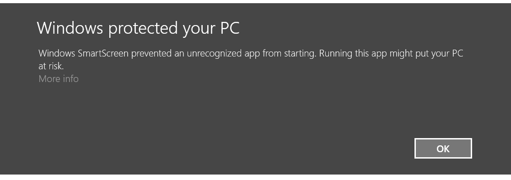

1. Please select `More info` and from the next message select `Run anyway`:

  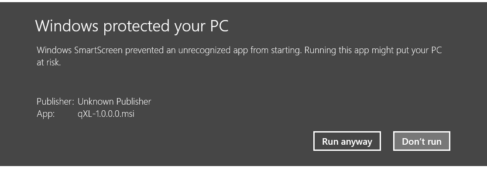
  
1. Select `Next`in the welcome screen:

  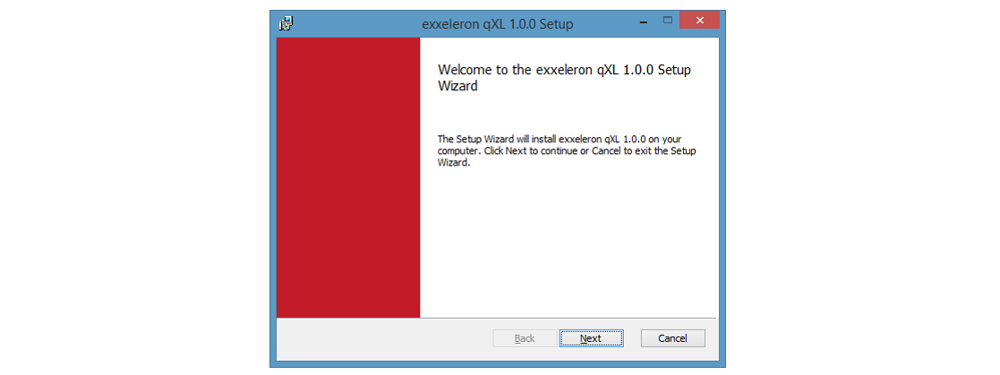

1. Read and accept the End-User License Agreement:

  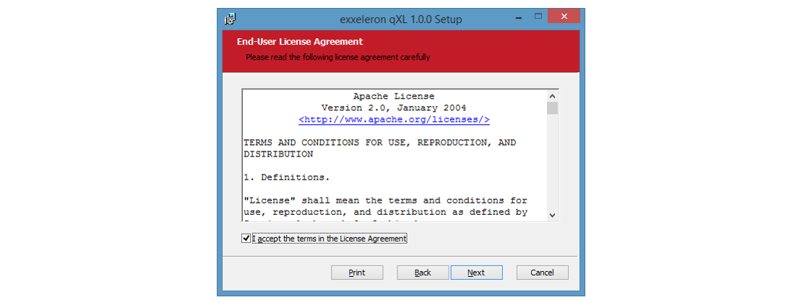
  
1. Select which `qXL` features (XLL AddIn, examples) shall be installed:

  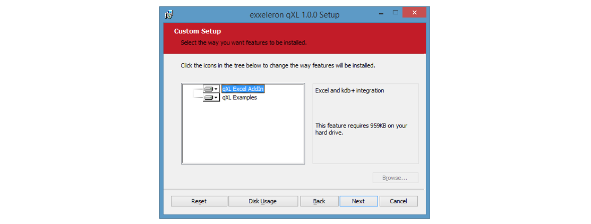
  
1. Optionally, adjust the location where the qXL examples are installed. Default location is `%USERPROFILE%\Documents\exxeleron qXL Examples\`:

  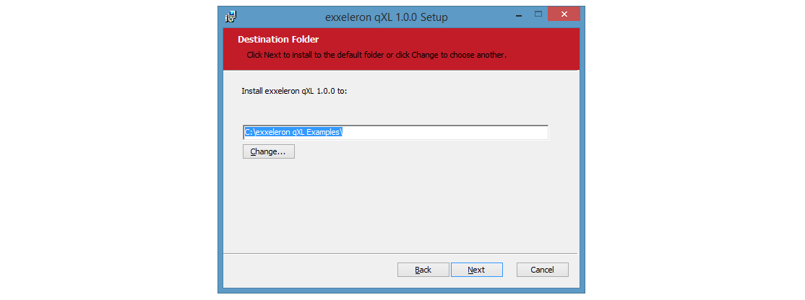

1. Click `Install` button. This will install all the files, create shortcuts and register class types for the current user on given workstation:

  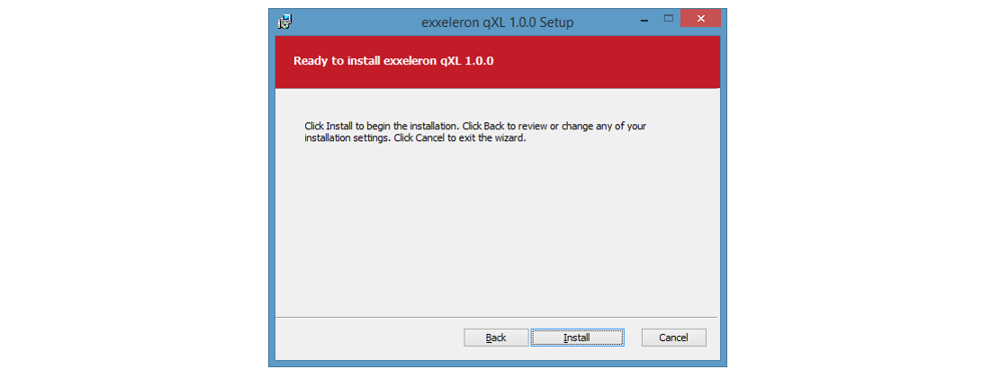

1. Wait for the installer to complete the installation process:

  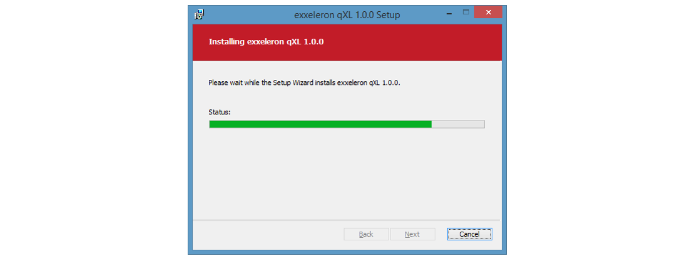

1. Finish the installation:

  

<!--------------------------------------------------------------------------------------------------------------------->

## Uninstalling `qXL`

1. Launch the `qXL` installer:

  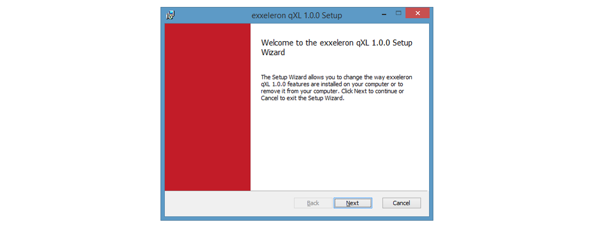
  
1. Click the `Remove` button:

  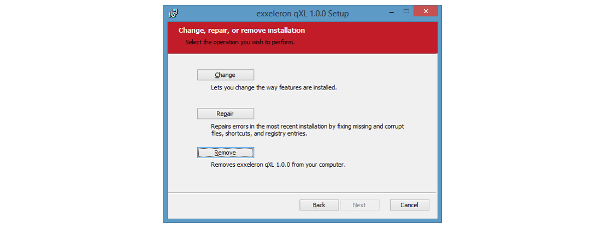

1. Click the `Remove` button:

  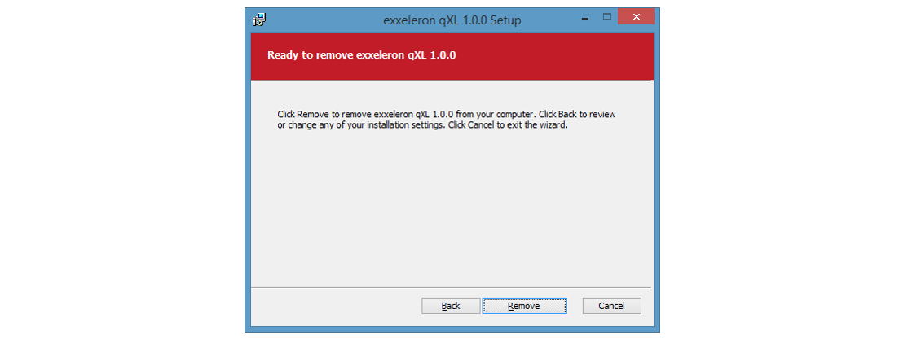
  
1. Wait for the installer to complete the uninstallation process:

  
  
1. Finish the uninstallation:

  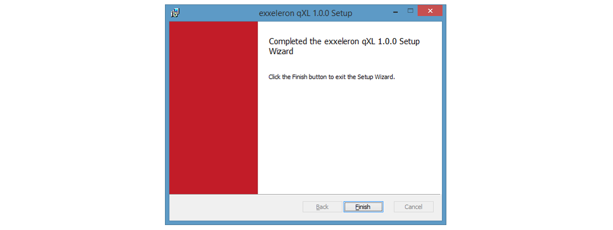
  
<!--------------------------------------------------------------------------------------------------------------------->

## Upgrading to newer version

To upgrade to a newer version, please uninstall previous version first and then run newer version of the installer.
